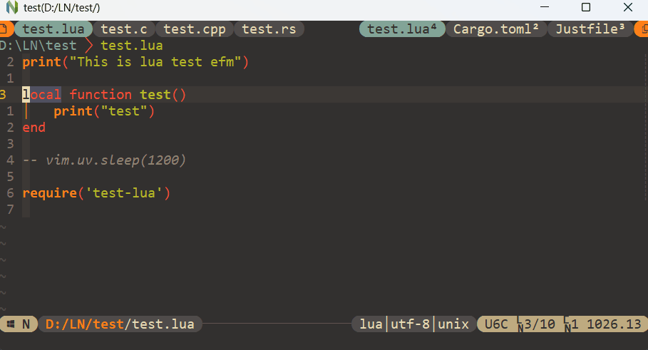
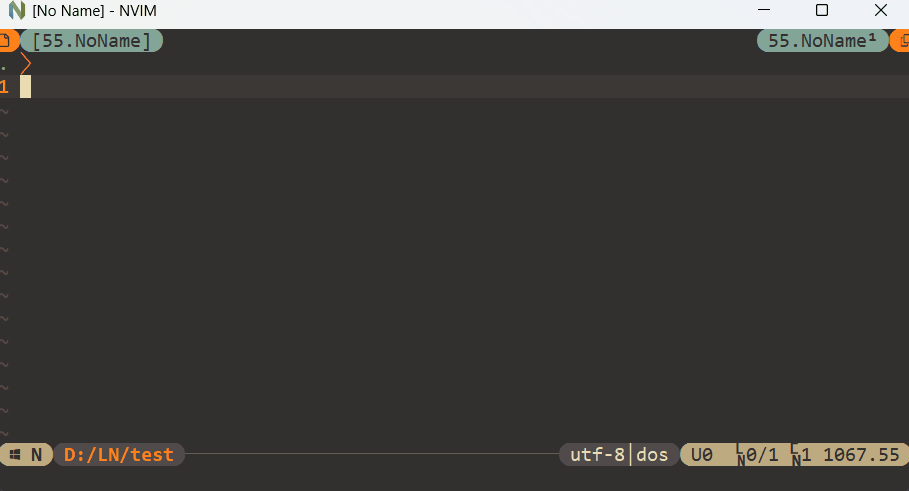

# Popc

**`Popc`** is a layer based context manager, including layer for buffers, bookmarks and worksapces.....

- `Buffer layer`

`Buffer layer` will track all buffers and tabpages automatically, and displays buffers scooped under tabpages at the tabline.

- `Workspace layer`

`Workspace layer` is mainly for saving/loading specified vim session along with user's settings required for workspace and layout of `buffer layer`.

- `Bookmark layer`

`Bookmark layer` is a convenient manager for bookmark files. 

> Support floating window of neovim(0.4.3+) and popupwin of vim (version 802+) with `let g:Popc_useFloatingWin = 1`.

## Search

To search context of `buffer`, `bookmark` or `workspace` layer, use fuzzy plugins(like LeaderF, fzf, Telescope.nvim).
And detailed can see [popc.txt](doc/popc.txt).

## Add Customized layer

All you need to do is implementing one **`layer`** struct and add to **`s:popc`**. The [Example layer](autoload/popc/layer/exp.vim) can be a good example layer to start.

Plugins using popc:
 - [popset](https://github.com/yehuohan/popset)
 - [popc-floaterm](https://github.com/yehuohan/popc-floaterm)

## Thinks

**Popc** is inspired by [vim-CtrlSpapce](https://github.com/vim-ctrlspace/vim-ctrlspace) and its one fork [vim-CtrlSpapce](https://github.com/yehuohan/vim-ctrlspace).
