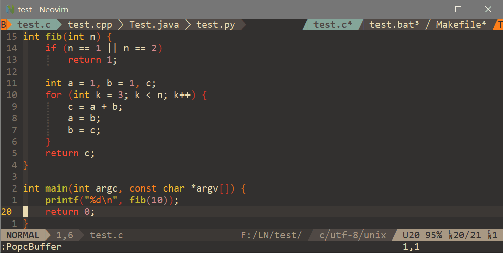
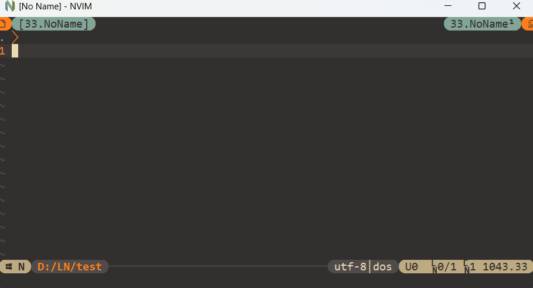
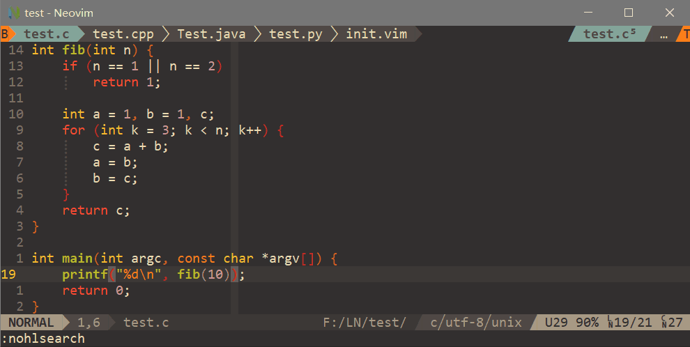

# Popc

> **Pop Out Panel of Custom user mode**
> - **WIP**: For neovim user, popc is going to re-implement with neovim lua (VimL version will be still kept)
> - For vim user, please see [Popc old version implemented with pure VimL](#popc-old-version-implemented-with-pure-viml)

Popc is to display a panel and handle all input keys based on an usermode.

## Setup

With lazy.nvim:

```lua
{
    'yehuohan/popc',
    config = function()
        require('popc').setup(opts)
    end,
    event = 'VeryLazy'
},
```

Default options:

```lua
opts = {
    debug = false,
    data_path = vim.fn.stdpath('data'),
    auto_setup_highlights = true, -- Add ColorScheme event for highlights
    icons = {
        popc = '󰯙',
        tabuf = '',
        bookmark = '',
        workspace = '',
        focus = '▪',
        win = '▫',
        tab = '',
        tab_scope = { '(', '╭', '│', '╰' },
        tab_focus = { '[', '┏', '┃', '┗' },
        tlbuf = '', -- Tabline buffer icon
        tltab = '', -- Tabline tabpage icon
        pointer = '󰜴',
        select = '',
        dots = '…',
        pads = { '', '' },
        nums = { '⁰', '¹', '²', '³', '⁴', '⁵', '⁶', '⁷', '⁸', '⁹' },
    },
    usermode = {
        input = nil, -- 'snacks'
        win = {
            border = 'rounded', -- 'none', 'single', 'double', 'rounded'
            number = true,
        },
        keys = {
            -- Set false to disable key
            ['<Esc>'] = 'quit',
            ['q'] = 'back',
            ['?'] = 'help',
            ['j'] = 'next',
            ['k'] = 'prev',
            ['J'] = 'next_page',
            ['K'] = 'prev_page',
            ['h'] = 'pop_tabuf',
        },
    },
    tabuf = { ... }, -- See `Tabuf` section
    workspace = { ... }, -- Set `Workspace` section
    bookmark = { ... }, -- Set `Bookmark` section
}
```


## `Tabuf`

`Tabuf` panel can track all buffers and tabpages automatically. And display hierarchical buffers and tabpages to floating panel and tabline.

<div align="center">

</div>

Default options:

```lua
opts = {
    tabuf = {
        enable = true,
        tabline = true,
        root_marker = { '.git' },
        exclude_buffer = function(bid)
            if vim.tbl_contains({ 'Popc', 'qf' }, vim.fn.getbufvar(bid, '&filetype')) then
                return true
            end
        end,
        keys = {
            -- Set false to disable key
            ['h'] = 'pop_buffers',
            ['l'] = 'pop_tabpages',
            ['a'] = 'pop_tabpage_buffers',
            ['<CR>'] = 'load_buffer_or_tabpage_quit', -- Load buffer into current window of current tabpage
            ['<Space>'] = 'load_buffer_or_tabpage',
            ['<S-CR>'] = 'goto_buffer_or_tabpage_quit', -- Goto buffer of corresponding window and tabpage
            ['<S-Space>'] = 'goto_buffer_or_tabpage',
            ['f'] = 'focus_on_window',
            ['s'] = 'split_buffer_quit',
            ['S'] = 'split_buffer',
            ['v'] = 'vsplit_buffer_quit',
            ['V'] = 'vsplit_buffer',
            ['t'] = 'tabnew_buffer_quit',
            ['T'] = 'tabnew_buffer',
            ['c'] = 'close_buffer_or_tabpage', -- Keep windows layout
            ['C'] = 'close_all_buffers_or_tabpages', -- Keep windows layout
            ['d'] = 'close_window', -- Only close window
            ['D'] = 'close_window_and_buffer', -- Also close window along with buffer
            ['i'] = 'switch_to_prev_tabpage',
            ['o'] = 'switch_to_next_tabpage',
            ['I'] = 'move_buffer_or_tabpage_to_prev', -- The selected item index follows buffer
            ['O'] = 'move_buffer_or_tabpage_to_next',
            ['<M-i>'] = 'move_out_buffer_or_tabpage_to_prev', -- The selected item index keeps unchanged
            ['<M-o>'] = 'move_out_buffer_or_tabpage_to_next',
            ['n'] = 'set_tabpage_label', -- Input empty string means delete label
            ['r'] = 'set_tabpage_dir', -- Support expand environment variables, input empty string means delete dir
            ['p'] = 'toggle_fullpath',
        },
    }
},
```

## Workspace

> **WIP**

## Bookmark

> **WIP**


---


# Popc old version implemented with pure VimL

> For installation and commands, please see [popc.txt](doc/popc.txt).

- `Buffer layer`

`Buffer layer` will track all buffers and tabpages automatically, and displays buffers scooped under tabpages at the tabline.

<div align="center">

</div>


- `Workspace layer`

`Workspace layer` is mainly for saving/loading specified vim session along with user's settings required for workspace and layout of `buffer layer`.

<div align="center">

</div>


- `Bookmark layer`

`Bookmark layer` is a convenient manager for bookmark files.

<div align="center">

</div>


> Support floating window of neovim(0.4.3+) and popupwin of vim (version 802+) with `let g:Popc_useFloatingWin = 1`.


### Search

To search context of `buffer`, `bookmark` or `workspace` layer, use fuzzy plugins(like LeaderF, fzf, Telescope.nvim).
And detailed can see [popc.txt](doc/popc.txt).


### Add Customized layer

All you need to do is implementing one **`layer`** struct and add to **`s:popc`**. The [Example layer](autoload/popc/layer/exp.vim) can be a good example layer to start.

Plugins using popc:
 - [popset](https://github.com/yehuohan/popset)
 - [popc-floaterm](https://github.com/yehuohan/popc-floaterm)


### Thinks

**Popc** is inspired by [vim-CtrlSpapce](https://github.com/vim-ctrlspace/vim-ctrlspace) and its one fork [vim-CtrlSpapce](https://github.com/yehuohan/vim-ctrlspace).
