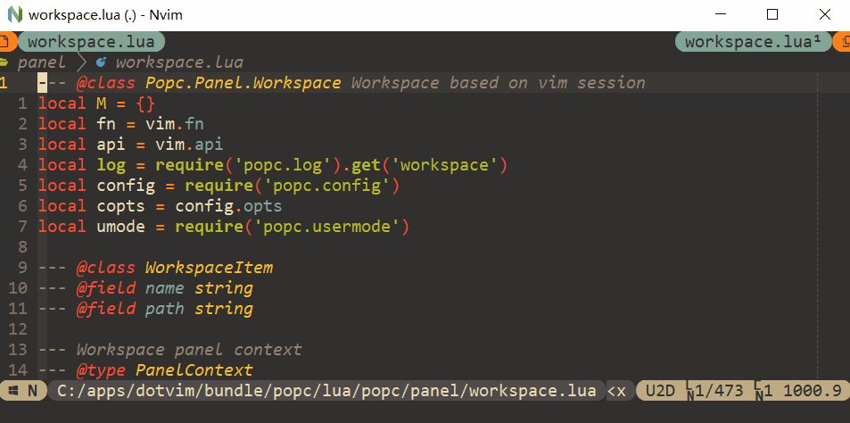

# Popc

> **Pop Out Panel of Custom user mode**
> - For vim user: VimL version code (its `README` can see [old branch](https://github.com/yehuohan/popc/tree/old)) is still kept and disabled for Neovim by default.

Popc is to display a panel and handle all input keys inside an usermode.

## Setup

***Install:***

```lua
-- e.g. with lazy.nvim:
{
    'yehuohan/popc',
    config = function()
        require('popc').setup(opts)
    end,
    event = 'VeryLazy'
},
```

***Default options:***

```lua
opts = {
    debug = false,
    data_path = vim.fn.stdpath('data'),
    auto_setup_highlights = true, -- Add ColorScheme event for highlights
    root_marker = { '.git' }, -- Detect root path for tabuf and workspace panel
    icons = {
        popc = '󰯙',
        tabuf = '',
        bookmark = '',
        workspace = '',
        focus = '▪',
        win = '▫',
        tab = '',
        tab_scope = { '(', '╭', '│', '╰' },
        tab_focus = { '[', '┏', '┃', '┗' },
        tlbuf = '', -- Tabline buffer icon
        tltab = '', -- Tabline tabpage icon
        pointer = '󰜴',
        select = '',
        dots = '…',
        pads = { '', '' },
        nums = { '⁰', '¹', '²', '³', '⁴', '⁵', '⁶', '⁷', '⁸', '⁹' },
    },
    usermode = {
        input = nil, -- 'snacks'
        win = {
            border = 'rounded', -- 'none', 'single', 'double', 'rounded'
            number = true,
        },
        -- Usermode's keys is the first priority handler
        keys = {
            -- Set false to disable key
            ['<Esc>'] = 'quit',
            ['q'] = 'back',
            ['?'] = 'help',
            ['j'] = 'next',
            ['k'] = 'prev',
            ['J'] = 'next_page',
            ['K'] = 'prev_page',
            ['h'] = 'pop_tabuf',
            ['b'] = 'pop_bookmark',
            ['w'] = 'pop_workspace',
        },
    },
    tabuf = { ... }, -- See `Tabuf` section
    workspace = { ... }, -- Set `Workspace` section
    bookmark = { ... }, -- Set `Bookmark` section
}
```

***Highlights for usermode:***

- `PopcFloat`: Floating window normal
- `PopcFloatBorder`: Floating window border
- `PopcFloatTitle`: Floating window title
- `PopcFloatTitleBar`: Floating window title bar for panel name
- `PopcFloatTitleBarSep`: Highlight between floating title and bar
- `PopcFloatTitleBarPad`: Highlight between floating title and border
- `PopcFloatSelect`: Floating selection indicator


## `Tabuf`

`Tabuf` panel can track all buffers and tabpages automatically. And display hierarchical buffers and tabpages to floating panel and tabline.

<div align="center">

</div>

***`Tabuf` commands:***

- `PopcTabuf`: Pop out `Tabuf` panel
- `PopcBufferSwitchLeft`: Switch to left buffer of current tabpage (works with `opts.tabuf.tabline = true`)
- `PopcBufferSwitchRight`: Switch to right buffer of current tabpage (works with `opts.tabuf.tabline = true`)
    - `PopcBufferSwitchLeft` and `PopcBufferSwitchRight` support `v:count1`, e.g. `:3PopcBufferSwitchLeft` will switch to the 3th left buffer
    - `PopcBufferSwitchLeft` and `PopcBufferSwitchRight` support bang, e.g. `:PopcBufferSwitchLeft!` will switch the last accessed window's buffer to left buffer
- `PopcBufferJumpPrev`: Jump to previous jumplist location of current buffer
- `PopcBufferJumpNext`: Jump to next jumplist location of current buffer
    - `PopcBufferJumpPrev` and `PopcBufferJumpNext` support `v:count1`, e.g. `:3PopcBufferJumpPrev!` will jump to 3th previous jumplist location
- `PopcBufferClose`: Close current buffer with window kept

***Default options:***

```lua
opts.tabuf = {
    enable = true,
    tabline = true,
    exclude_buffer = function(bid)
        if vim.tbl_contains({ 'Popc', 'qf' }, vim.fn.getbufvar(bid, '&filetype')) then
            return true
        end
    end,
    keys = {
        -- Set false to disable key
        ['h'] = 'pop_buffers',
        ['l'] = 'pop_tabpages',
        ['a'] = 'pop_tabpage_buffers',
        ['<CR>'] = 'load_buffer_or_tabpage_quit', -- Load buffer into current window of current tabpage
        ['<Space>'] = 'load_buffer_or_tabpage',
        ['<S-CR>'] = 'goto_buffer_or_tabpage_quit', -- Goto buffer of corresponding window and tabpage
        ['<S-Space>'] = 'goto_buffer_or_tabpage',
        ['f'] = 'focus_on_window',
        ['s'] = 'split_buffer_quit',
        ['S'] = 'split_buffer',
        ['v'] = 'vsplit_buffer_quit',
        ['V'] = 'vsplit_buffer',
        ['t'] = 'tabnew_buffer_quit',
        ['T'] = 'tabnew_buffer',
        ['c'] = 'close_buffer_or_tabpage', -- Keep windows layout
        ['C'] = 'close_all_buffers_or_tabpages', -- Keep windows layout
        ['d'] = 'close_window', -- Only close window
        ['D'] = 'close_window_and_buffer', -- Also close window along with buffer
        ['i'] = 'switch_to_prev_tabpage',
        ['o'] = 'switch_to_next_tabpage',
        ['I'] = 'move_buffer_or_tabpage_to_prev', -- The selected item index follows buffer
        ['O'] = 'move_buffer_or_tabpage_to_next',
        ['<M-i>'] = 'move_out_buffer_or_tabpage_to_prev', -- The selected item index keeps unchanged
        ['<M-o>'] = 'move_out_buffer_or_tabpage_to_next',
        ['n'] = 'set_tabpage_label', -- Input empty string means delete label
        ['r'] = 'set_tabpage_dir', -- Support expand environment variables, input empty string means delete dir
        ['p'] = 'toggle_fullpath',
    },
}
```

***Highlights for `Tabuf` tabline:***

- `PopcTlBar`: Bar to indicate tabpage or buffer 
- `PopcTlNormal`: Normal tabpage or buffer
- `PopcTlCurrent`: Current tabpage or buffer
- `PopcTlModified`: Tabpage or buffer has modification
- `PopcTlCurrentModified`: Current tabpage or buffer has modification
- `PopcTl<XXX>Pad`: Padding for bar/tabpage/buffer


## `Workspace`

`Workspace` panel is mainly for saving/loading vim sessions along with user data.

<div align="center">

</div>

***`Workspace` commands:***

- `PopcWorkspace`: Pop out `Workspace` panel

***Default options:***

```lua
opts.workspace = {
    enable = true,
    keys = {
        -- Set false to disable key
        ['<CR>'] = 'open_workspace', -- Open workspace: drop all original tabpages and buffers
        ['t'] = 'load_workspace', -- Load workspace: keep original tabpages and buffers
        ['a'] = 'append_workspace', -- Append a new workspace
        ['d'] = 'delete_workspace', -- Delete the seleted  workspace
        ['s'] = 'save_workspace', -- Override the same workspace
        ['S'] = 'save_workspace_forcely', -- Override the seleted workspace forcely
        ['n'] = 'set_workspace_name',
        ['r'] = 'set_workspace_root',
        ['g'] = 'sort_workspace',
    },
}
```

***Save/load user data:***

```lua
vim.api.nvim_create_augroup('MyWks', { clear = true })
vim.api.nvim_create_autocmd('User', {
    group = 'MyWks',
    pattern = 'PopcWorkspaceSavePre',
    callback = function()
        require('popc.panel.workspace').cmd_set_userdata({
            -- Save user data here
        })
    end,
})
vim.api.nvim_create_autocmd('User', {
    group = 'MyWks',
    pattern = 'PopcWorkspaceLoaded',
    callback = function()
        -- Load user data here
        local userdata = require('popc.panel.workspace').cmd_get_userdata()
    end,
})
```


## `Bookmark`

`Bookmark` panel is a convenient container of bookmark files.

<div align="center">

</div>

***`Bookmark` commands:***

- `PopcBookmark`: Pop out `Bookmark` panel

***Default options:***

```lua
opts.Bookmark = {
    enable = true,
    keys = {
        -- Set false to disable key
        ['<CR>'] = 'load_bookmark_quit',
        ['<Space>'] = 'load_bookmark',
        ['s'] = 'split_bookmark_quit',
        ['S'] = 'split_bookmark',
        ['v'] = 'vsplit_bookmark_quit',
        ['V'] = 'vsplit_bookmark',
        ['t'] = 'tabnew_bookmark_quit',
        ['T'] = 'tabnew_bookmark',
        ['a'] = 'append_bookmark', -- Append current buffer as bookmark
        ['d'] = 'delete_bookmark',
        ['g'] = 'sort_bookmark',
    },
}
```


## `Selection`

> **WIP:** Re-implement [popset](https://github.com/yehuohan/popset)
